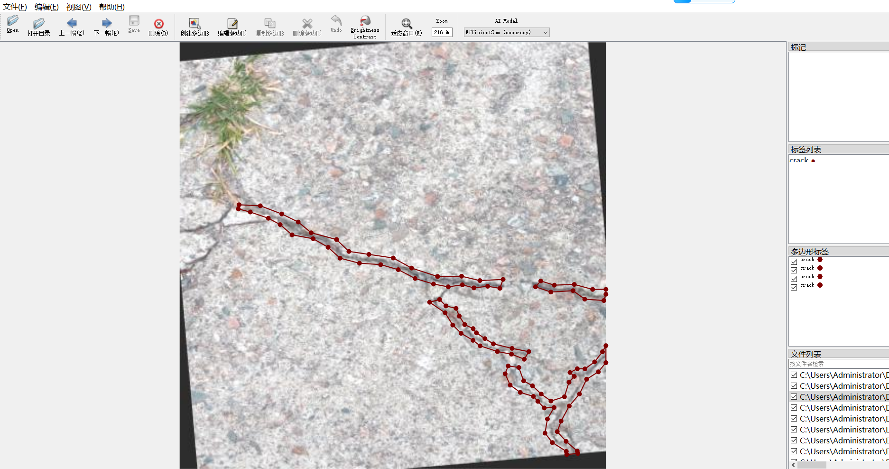
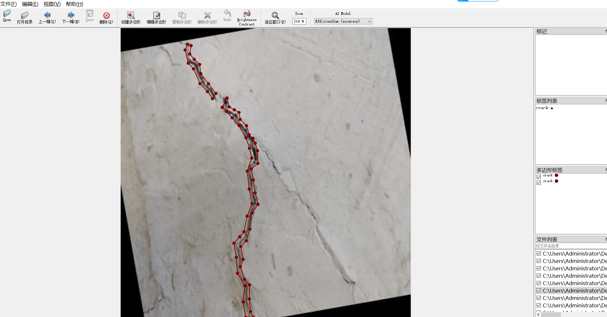
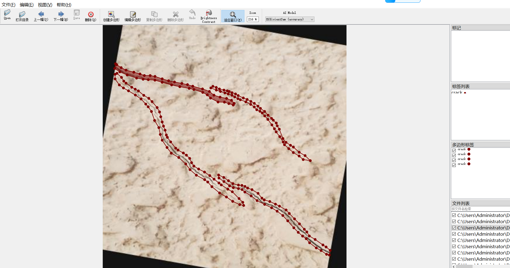

# Wall Surface Crack Segmentation Dataset 4028 imagesjsonformat （(Augmented) ）

Wall Crack Segmentation Dataset (4028 images, JSON format, enhanced)

This dataset is a collection of wall cracks, with 4028 images in JSON format and enhanced.

This wall crack dataset consists of 4028 clear resolution images, which are enlarged from the original images by data augmentation techniques (such as mirror flipping, rotation, brightness adjustment, contrast transformation, adding Gaussian noise, etc.), significantly enhancing the diversity of data and effectively alleviating the problem of scarcity of samples in practical engineering. It is suitable for training and evaluation of deep learning models.

The dataset images are sourced from real-world scenarios such as building facades, bridges, tunnels, and concrete structures, encompassing various forms of crack patterns including transverse, longitudinal, and mesh-like. They include cases involving fine cracks, wide cracks, along with accompanying peeling and staining backgrounds, presenting high realism and challenging characteristics. All images have been professionally annotated to accurately depict the pixel-level contours of the cracks.

```json
{
  "images": [
    {
      "filename": "image1.jpg",
      "metadata": {
        "width": 640,
        "height": 480
      },
      "polygons": [
        {
          "x1": 0,
          "y1": 0,
          "x2": 320,
          "y2": 0
        },
        {
          "x1": 320,
          "y1": 0,
          "x2": 640,
          "y2": 0
        }
      ],
      "labels": ["crack"]
    },
    {
      "filename": "image2.jpg",
      "metadata": {
        "width": 640,
        "height": 480
      },
      "polygons": [
        {
          "x1": 0,
          "y1": 0,
          "x2": 320,
          "y2": 0
        },
        {
          "x1": 320,
          "y1": 0,
          "x2": 640,
          "y2": 0
        }
      ],
      "labels": ["crack"]
    }
  ]
}
```

The dataset is suitable for segmentation networks such as U-Net, DeepLab, SegNet, etc. It can be widely used in artificial intelligence systems, such as building structure health monitoring, intelligent inspection robots, and post-disaster assessment. It provides a high-quality data foundation for realizing automated, high-precision crack recognition and quantitative analysis, and is an important resource in the field of intelligent construction and infrastructure maintenance.

## Images







---

Here is a pay link on Stripe (https://buy.stripe.com/3cs8yP7sY87d0vu9AB). Please contact me lonlonago@foxmail.com after funding $89, and I will send you a complete data files, thank you!


